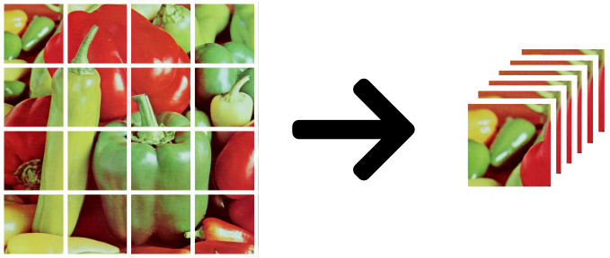
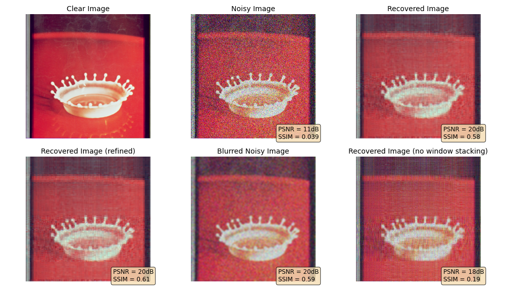
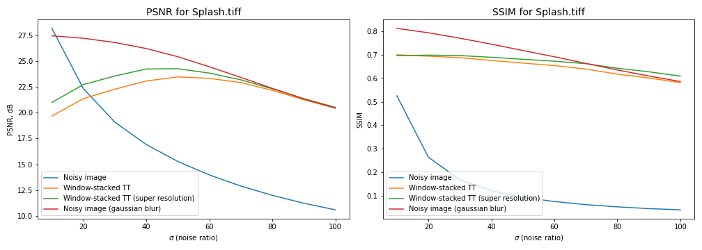

# tt-denoising
Image denoising with Tensor Train tensor decomposition and super-resolution.

## Pipeline

We propose to use the batched version of the image `(H x W x C)` to construct a tensor `(H // n, n, W // m, m, C)` and then decompose it with ADMM (alternating direction method of multipliers).

<p align="center">
  
</p>

This approach achieves better performance compared to the plain Tensor Train decomposition of the noisy image. The intuition behind this is
* many patches of image have close textures;
* noise varies, while similar textures stay the same;
* decomposition can extract these textures as sparse components of stacked image representation;

However, while the sparse structure extracts meaningful information about textures, it also blurs high-frequency details. We propose to use the super-resolution techniques to improve the overall quality of the resulting image. Specifically, we selected the [Laplacian Pyramid Super-Resolution Network (LapSRN)](https://github.com/phoenix104104/LapSRN) model for this purpose. 

<p align="center">
  
</p>

<p align="center">
  
</p>

## Environment

**Important:** recommended having [`Jupyter Lab`](https://jupyterlab.readthedocs.io/en/stable/getting_started/installation.html) installed in the `base` conda environment. For the best experience, you may also install [`nb_conda_kernels`](https://github.com/Anaconda-Platform/nb_conda_kernels) and [`ipywidgets`](https://ipywidgets.readthedocs.io/en/latest/user_install.html#installing-in-jupyterlab-3-0). Also, using [`mamba`](https://mamba.readthedocs.io/en/latest/) is recommended.

1. Create conda environment:
   ```bash
   $ conda env create --file environment.yaml
   ```
2. Activate it:
   ```bash
   $ conda activate denoising-env
   ```

## Super-resolution Models

1. Download model files from [here](https://github.com/fannymonori/TF-LapSRN/tree/master/export):
* `LapSRN_x2.pb`
* `LapSRN_x4.pb`
* `LapSRN_x8.pb`

2. Put them into the `models/` folder.


## Our team

* Artemenkov Aleksandr
* Paplavsky Nikita  
* Shubin Artem

This repository is a supplement to the **Tensor Decompositions and Tensor Networks in Artificial Intelligence** course project at **Skolkovo Institute of Science and Technology**. 